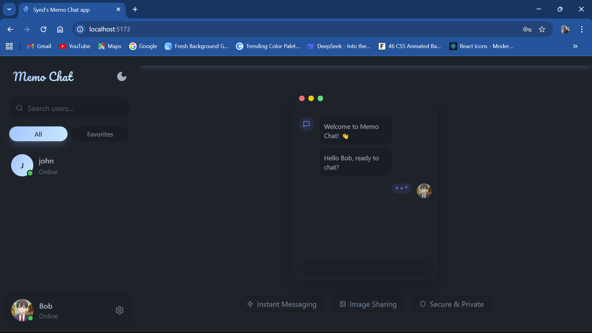
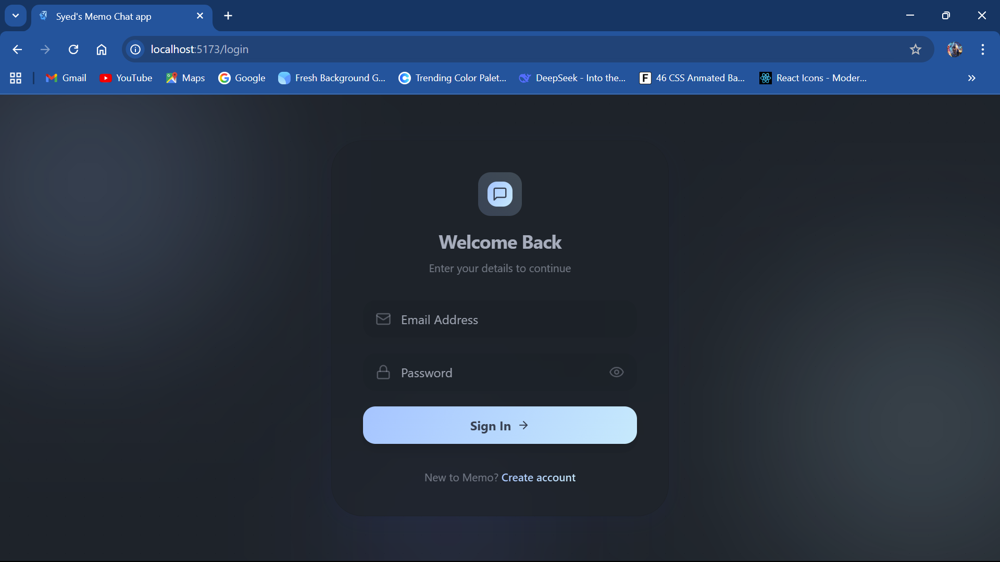
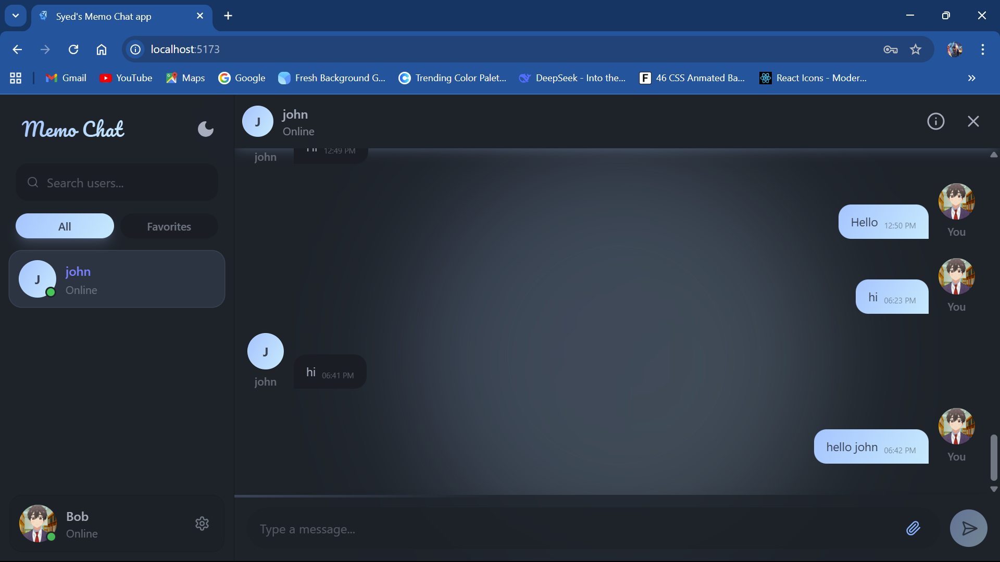
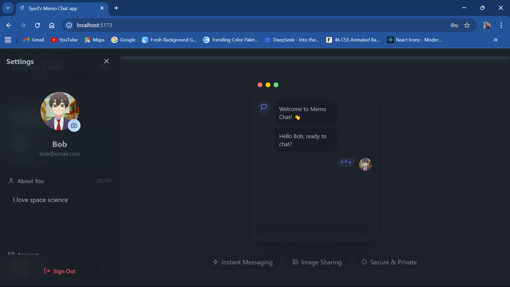

# Memo Chat - Realtime MERN Chat Application


A modern, secure, and fully responsive real-time chat application built with the MERN stack. Features real-time messaging, persistent read receipts, image sharing, and a beautiful UI powered by DaisyUI.



## 🚀 Features

- **Real-time Messaging**: Instant message delivery using Socket.io.
- **Persistent Read Receipts**: Know exactly when your messages are read, even after refreshing.
- **Secure Authentication**: JWT-based auth with HttpOnly cookies and CSRF protection.
- **Image Sharing**: Upload and share images instantly via Cloudinary.
- **Responsive Design**: Fully optimized for mobile, tablet, and desktop devices.
- **Online Status**: Real-time online/offline user status updates.
- **Theme Support**: Switch between Light and Dark modes.
- **Security Headers**: Production-ready security with Helmet and strict CORS policies.

## 🛠️ Tech Stack

**Frontend:**
- React.js (Vite)
- TailwindCSS & DaisyUI (Styling)
- Zustand (State Management)
- Axios (API Requests)
- Socket.io Client

**Backend:**
- Node.js & Express.js
- MongoDB (Database)
- Socket.io (Real-time Engine)
- Cloudinary (Image Storage)
- Helmet (Security)

## 📸 Screenshots

| Login / Signup | Home (No Chat) |
|:---:|:---:|
|  |  |

| Active Chat | User Profile |
|:---:|:---:|
|  |  |

| Settings & Bio | Details Panel |
|:---:|:---:|
|  |  |

## ⚙️ Installation & Setup

1. **Clone the repository**
   ```bash
   git clone https://github.com/Syed9514/Memo-chat-app-SK.git
   cd Memo-chat-app-SK
   ```

2. **Install Dependencies**
   ```bash
   npm run build
   ```

3. **Environment Setup**
   Create a `.env` file in the `backend` directory:
   ```env
   PORT=5001
   MONGODB_URI=your_mongodb_connection_string
   JWT_SECRET=your_jwt_secret
   CLOUDINARY_CLOUD_NAME=your_cloud_name
   CLOUDINARY_API_KEY=your_api_key
   CLOUDINARY_API_SECRET=your_api_secret
   NODE_ENV=development
   ```

   Create a `.env` file in the `frontend-01` directory:
   ```env
   VITE_API_URL=http://localhost:5001
   ```

4. **Run Locally**
   Start the backend and frontend in separate terminals:
   ```bash
   # Terminal 1: Backend
   cd backend
   npm run dev

   # Terminal 2: Frontend
   cd frontend-01
   npm run dev
   ```

## 🔒 Security & Deployment

This project is configured for secure deployment:
- **Automatic Environment Switching**: Detects if running on `localhost` or Production to adjust cookie security.
- **Secure Cookies**: Uses `httpOnly` and `secure` flags (in production).
- **Helmet**: Adds security headers to prevent common attacks.

## 👤 Author

**Syed Kalam**

- LinkedIn: [Syed Kalam](https://www.linkedin.com/in/syed-kalam-590407270)
- GitHub: [Syed Kalam](https://github.com/Syed9514)


---

*Built with ❤️ using the MERN Stack by Syed kalam*
